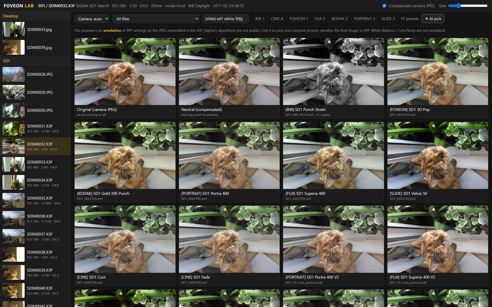

# Foveon Lab

Try Sigma Photo Pro (SPP) presets on your Sigma SD1 / SD15 **X3F** files, side by side, in the browser —
without importing, clicking and waiting in SPP for every preset.



- Scans your folders for `.X3F` files and reads the **full-size JPEG embedded in each X3F**
  (SD1 Merrill: 4704×3136, SD15: 2640×1760). No Foveon raw decoding needed.
- Loads every SPP preset XML it finds (comma or dot decimals, identical duplicates folded),
  filters by camera, `[GROUP]` tag, file or name.
- **Grid view:** one photo through every preset at once. Click a tile for a large view with sliders;
  `←`/`→` steps through presets, hold `O` for the camera original.
- **Save as preset** writes an SPP-importable XML (`FoveonLab_SD1.xml` / `FoveonLab_SD15.xml` in the
  presets folder; saving the same name replaces it instead of duplicating).
- **Export JPEG** renders the full preview resolution next to the photo, in a `foveon-lab/` folder.
- **Calibration tools** measure what SPP actually does, to replace guesses with measured curves (below).

Single Go binary, no runtime dependencies, runs locally on `127.0.0.1` only.

## Install

```
go install github.com/biopoetic/foveon-lab@latest
```

or clone and `go build -o foveon-lab.exe .` (Go 1.25+).

## Usage

```
foveon-lab                       # scans your Desktop, presets from "Desktop/foveon pack", opens the browser
foveon-lab -photos "D:\Photos;E:\Sigma" -presets "D:\SPP presets" -port 8777 -no-open
```

Photos are found up to 4 levels below each `-photos` folder.

## Open in Sigma Photo Pro (Windows, SPP 6)

**Open in SPP ↗** in the editor hands the current preset straight to SPP: it adds it to SPP's preset
list, makes it SPP's current adjustment and launches SPP on the photo — no XML import step.

How it works: SPP keeps no per-photo edits. Its preset list is
`%LOCALAPPDATA%\SIGMA\SIGMA_PhotoPro6\X3F_Setting.xml` and its current adjustment is the `X3F_*` keys in
`SPhotoPro.xml` there. Foveon Lab edits both **only while SPP is closed** (SPP rewrites them on exit),
backs them up first to `foveon-lab-backups\` next to them (last 10 kept), and prefixes everything it
writes with `[FL]` so your own SPP presets are never overwritten. Your X3F files are never modified.

## AI agent: pick and tune a preset for you

Click **✦ AI pick** (grid) or **✦ AI** (editor). A vision model looks at the photo, shortlists presets
by rendering them on it, compares the renders (each comes with objective stats: clipping, crushed
shadows, brightness, saturation, warmth), fine-tunes the best one, and explains its choice. You watch
every step live, then **Open in editor** to save it as an SPP preset or export it. You can give it a
direction, e.g. *"warm film look"*, *"moody"*, *"natural skin"*.

It works with any OpenAI-compatible Chat Completions API that accepts images and tool calls. The
default is DeepSeek's `deepseek-flash`:

```
set DEEPSEEK_API_KEY=sk-...          # Windows (export ... on macOS/Linux)
foveon-lab
foveon-lab -ai-base https://api.openai.com/v1 -ai-model <vision model> -ai-key-env OPENAI_API_KEY
```

- Downscaled renders of the photo (≤ 768 px) are sent to the model provider.
- A run is typically 4–8 model calls, ~60–100k input tokens — about 1–2 US cents on DeepSeek
  (September 2026 pricing).
- The agent judges the emulated preview, so its choices inherit the emulation's limits (see below).

## Limitations — read this

- **The preview is an emulation, not SPP.** Sigma's algorithms (X3 Fill Light, colour modes, highlight
  handling) are not public. The emulation (`render/`) gets the direction and relative strength of each
  preset right, not the exact pixels. Use it to choose and compare presets; develop final images in SPP.
- **The source is the camera's own JPEG**, which already has the in-camera colour mode applied (often
  *Vivid*). "Compensate camera JPEG" undoes that approximately, from the X3F metadata
  (`CM_DESC`, `SATU_DESC`, `CONT_DESC`), so presets start from a more neutral base.
- **ColorMode codes**: 4 = Standard, 6 = Portrait, 7 = Landscape were inferred from preset packs; other
  codes are unknown (the calibration pack probes them).
- **White Balance / ColorTemp** are kept and written back but not emulated.
- Tested with SD1 Merrill (X3F 3.0) and SD15 (X3F 2.3) files. Other Foveon cameras (DP Merrill,
  Quattro, fp) are untested.

## Calibration: measuring SPP instead of guessing

```
foveon-lab calibrate   # creates Desktop/foveon-calibration: preset pack + INSTRUCTIONS.txt + exports/
foveon-lab analyze     # measures the exports → report.txt + calibration.json
```

Each `[CAL]` preset moves exactly **one** SPP control to a known value (e.g. Contrast +0.5); everything
else matches the neutral preset `A00`. You apply each preset in SPP to the same photo and save it as
`<photo>_<code>.tif`. `analyze` then compares every export with SPP's own neutral `A00` export and
reports, per control:

- the tone curve (output vs input brightness),
- the saturation gain,
- a 3×3 linear colour matrix (for colour modes and colour adjust) and its fit error,
- whether it acts locally (Fill Light) — brightness shift by pixel vs. surrounding brightness,
- **how far this project's emulation is from SPP** for the same setting.

`calibrate` also suggests good calibration photos from your library (wide tonal range, colour,
little clipping). This is black-box measurement of SPP's output; nothing is decompiled.

## Project layout

| Path | What |
|---|---|
| `x3f/` | X3F container: section directory, embedded JPEGs, PROP metadata |
| `preset/` | SPP preset XML reading/writing |
| `render/` | linear-light float pipeline emulating the SPP sliders |
| `calib/` | calibration preset pack, export analysis, source-photo suggestions |
| `agent/` | vision-model agent loop (tools: `render_presets`, `render`, `finish`) |
| `spp/` | hand-off to an installed Sigma Photo Pro 6 (preset list + current setting) |
| `web/index.html` | the UI (embedded into the binary) |

```
go test ./...
```

Tests that use real X3F files or preset folders skip themselves when those are not on the machine.

## Contributing

Issues and pull requests are welcome — especially calibration results (`report.txt`) from SPP, and
X3F samples from other Foveon cameras.

## Legal

MIT licensed — see [LICENSE](LICENSE).

Sigma, Foveon, X3F and Sigma Photo Pro are trademarks of SIGMA Corporation. This is an independent
project, not affiliated with or endorsed by SIGMA Corporation. It reads the documented-by-the-community
X3F container format and never modifies your original files.
